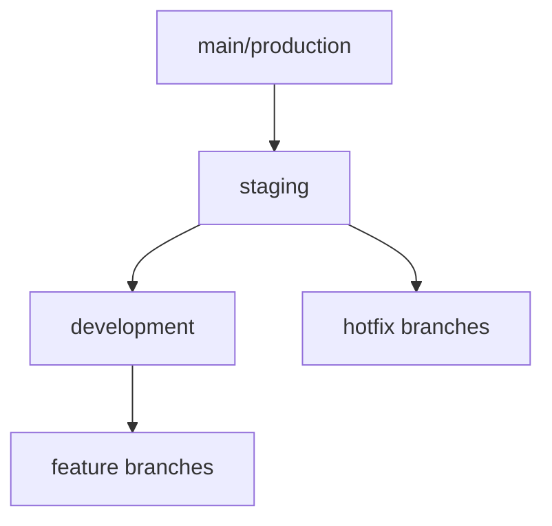

[← Back to Documentation Home](../README.md)

# Managing Multiple Branches: A Comprehensive Guide

## Branch Structure Overview



## Branch Types and Purposes

### 1. Production Branch (`main` or `master`)
- **Purpose**: Contains production-ready code
- **URL**: https://www.dhg-hub.org
- **Characteristics**:
  - Highly stable
  - Thoroughly tested
  - Ready for end users
  - Protected from direct pushes

### 2. Staging Branch (`staging`)
- **Purpose**: Pre-production testing environment
- **URL**: https://staging.dhg-hub.org
- **Characteristics**:
  - Integration testing
  - UAT (User Acceptance Testing)
  - Final QA checks
  - Performance testing

### 3. Development Branch (`development`)
- **Purpose**: Active development integration
- **URL**: https://dev.dhg-hub.org
- **Characteristics**:
  - Latest development code
  - Feature integration
  - Initial testing
  - Potentially unstable

### 4. Feature Branches
- **Purpose**: Individual feature development
- **Naming**: `feature/feature-name`
- **Characteristics**:
  - Created from development branch
  - One feature per branch
  - Merged back to development
  - Short-lived

### 5. Database Migration Branches
- **Purpose**: Database schema changes
- **Naming**: `feature/db-migration-XXX`
- **Characteristics**:
  - Include migration scripts
  - Include rollback scripts
  - Thorough testing required
  - Documentation updates

## Workflow Guidelines

### 1. Starting New Development

```bash
# Start from development branch
git checkout development
git pull origin development

# Create new feature branch
git checkout -b feature/your-feature-name

# Work on your feature...
git add .
git commit -m "Description of changes"
git push origin feature/your-feature-name
```

### 2. Merging Process

```bash
# Update your feature branch
git checkout feature/your-feature-name
git pull origin development

# Fix any conflicts
# Run tests
npm test

# Create pull request to development branch
# After review and approval, merge to development
```

### 3. Promoting to Staging

```bash
# After features are tested in development
git checkout staging
git pull origin staging
git merge development
git push origin staging

# Deploy to staging environment
# Run integration tests
```

### 4. Production Deployment

```bash
# After staging is verified
git checkout main
git pull origin main
git merge staging
git push origin main

# Deploy to production
vercel --prod
```

## Database Migration Workflow

### 1. Creating Migration Branch

```bash
git checkout development
git checkout -b feature/db-migration-001

# Create migration files
# Test migrations locally
# Document changes
```

### 2. Testing Migrations

1. Test in development first
2. Apply to staging environment
3. Verify data integrity
4. Test rollback procedures
5. Update documentation

### 3. Production Migration

```bash
# After thorough testing
git checkout main
git merge feature/db-migration-001
git push origin main

# Apply migrations to production
# Verify successful migration
# Monitor for issues
```

## Best Practices

1. **Never Commit Directly to Main**
   - Always use feature branches
   - Require pull request reviews
   - Maintain clean commit history

2. **Regular Updates**
   ```bash
   # Keep your branch updated
   git checkout your-branch
   git pull origin development
   ```

3. **Clear Branch Names**
   - Use descriptive names
   - Follow naming conventions
   - Include ticket numbers if applicable

4. **Clean Up Branches**
   ```bash
   # Delete merged branches
   git branch --merged
   git branch -d feature/completed-feature
   ```

5. **Documentation**
   - Update docs with branch changes
   - Document deployment steps
   - Keep README current

## Troubleshooting

### 1. Merge Conflicts
```bash
# If you encounter merge conflicts
git status  # Check conflicting files
git merge --abort  # If needed to start over
# Resolve conflicts manually
git add .
git commit -m "Resolved merge conflicts"
```

### 2. Wrong Branch
```bash
# If you committed to wrong branch
git log  # Find commit hash
git checkout correct-branch
git cherry-pick <commit-hash>
```

### 3. Recovery
```bash
# If you need to recover deleted work
git reflog  # Find lost commits
git checkout -b recovery-branch <commit-hash>
```

## Environment Configuration

Each branch should have its own environment configuration:

```plaintext
.env.development
.env.staging
.env.production
```

Use the appropriate configuration file for each environment:

```bash
# Start development server with specific environment
npm run start:dev
npm run start:staging
npm run start:prod
```

Remember to maintain separate database instances for each environment to prevent cross-contamination of data.

## Monitoring and Maintenance

1. **Regular Health Checks**
   - Monitor deployment status
   - Check error rates
   - Review performance metrics

2. **Branch Cleanup**
   - Remove stale branches
   - Archive old features
   - Maintain clean repository

3. **Documentation Updates**
   - Keep deployment guides current
   - Update architecture diagrams
   - Maintain change logs

## Additional Resources

- [Git Documentation](https://git-scm.com/doc)
- [Vercel Deployment Guide](https://vercel.com/docs)
- [Database Migration Best Practices](https://docs.supabase.com/guides/database/migrations) 