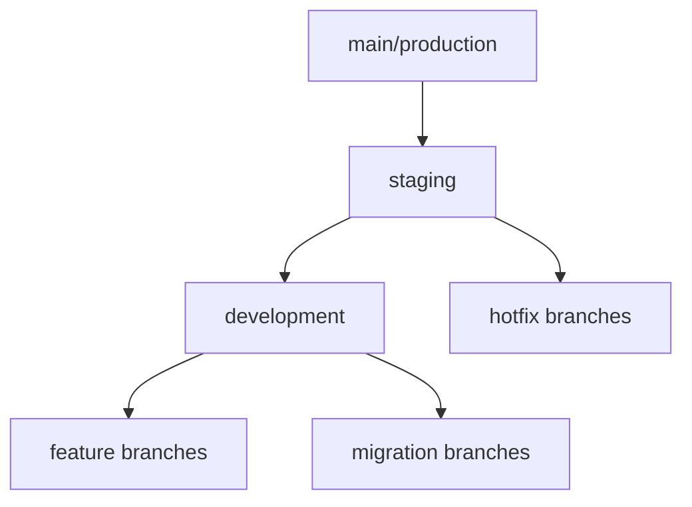

[← Back to Documentation Home](../../README.md)

# Branch Management Best Practices

## Quick Reference
```bash
# Create new feature branch
git checkout development
git checkout -b feature/my-feature

# Keep feature branch updated
git fetch origin
git rebase origin/development

# Create hotfix
git checkout staging
git checkout -b hotfix/critical-fix

# Promote changes
./scripts/promote.sh development staging
./scripts/promote.sh staging main
```

## Branch Hierarchy



## Branch Naming Conventions

```bash
feature/   # New features: feature/user-auth
bugfix/    # Non-critical fixes: bugfix/header-alignment
hotfix/    # Critical fixes: hotfix/login-failure
migration/ # Database changes: migration/20240315-user-table
release/   # Release branches: release/v1.2.0
```

## Branch Strategy Overview

This branching strategy represents a hierarchical flow of code changes through different environments, ensuring code quality and stability at each level.

### Branch Hierarchy Explanation

#### 1. Main/Production Branch
- The topmost branch in the hierarchy
- Contains production-ready code
- Should always be stable and deployable
- Tagged with version numbers for releases
- Protected with strict rules
- Requires signed commits

#### 2. Staging Branch
- Second level in the hierarchy
- Used for pre-production testing
- Integration point before production deployment
- Quality assurance (QA) testing happens here
- All production deployments must pass through here
- Automated testing environment

#### 3. Development Branch
- Third level in the hierarchy
- Main integration branch for ongoing development
- All feature and migration branches merge here first
- Should be relatively stable but may contain work in progress
- Continuous integration runs here
- Automated tests must pass

#### 4. Working Branches
These are the branches where actual development occurs:

- **Feature Branches**
  - Created for new features
  - Branch from: Development
  - Merge back to: Development
  - Naming convention: `feature/feature-name`
  - Should be short-lived (1-2 weeks max)
  - One feature per branch

- **Migration Branches**
  - Specific to database or infrastructure migrations
  - Branch from: Development
  - Merge back to: Development
  - Naming convention: `migration/migration-name`
  - Must include rollback procedures
  - Requires database admin review

- **Hotfix Branches**
  - For urgent production fixes
  - Branch from: Staging
  - Merge to: Staging AND Main/Production
  - Naming convention: `hotfix/issue-description`
  - Requires expedited review process
  - Must include regression tests

- **Release Branches**
  - For release preparation
  - Branch from: Development
  - Merge to: Staging
  - Naming convention: `release/vX.Y.Z`
  - Only bugfixes allowed
  - Tagged when merged to main

### Flow of Changes

1. Developers create feature/migration branches from Development
2. Changes are merged back to Development after code review
3. Development changes are promoted to Staging for testing
4. After QA approval, Staging changes are merged to Production
5. Hotfixes follow an expedited path through Staging to Production

### Automated Checks

Each branch level has specific automated checks:

```bash
Development:
- Linting
- Unit tests
- Integration tests
- Build verification

Staging:
- All development checks
- End-to-end tests
- Performance tests
- Security scans

Production:
- All staging checks
- Load testing
- Compliance checks
```

## Best Practices

1. **Branch Hygiene**
   - Delete merged feature branches
   - Keep branches up to date
   - Regular rebasing on development
   - No direct commits to protected branches
   - Keep branches focused and small

2. **Commit Messages**
   - Clear, descriptive messages
   - Reference issue numbers
   - Use conventional commits
   - Sign your commits
   - Include context when needed

3. **Pull Requests**
   - Include description of changes
   - Add relevant reviewers
   - Link to related issues
   - Include test results
   - Add screenshots for UI changes
   - Update documentation

4. **Protection Rules**
   - Protect main and staging branches
   - Require PR reviews
   - Enforce status checks
   - No force pushes
   - Require signed commits
   - Linear history required

5. **Regular Maintenance**
   - Clean up old branches
   - Regular merges to staging
   - Scheduled deployments
   - Document major changes
   - Monitor branch age
   - Archive old releases

## Branch Lifecycle Management

```bash
# List old branches
git branch --sort=-committerdate

# Clean up merged branches
git branch --merged | grep -v "\*" | xargs -n 1 git branch -d

# Archive old releases
git tag archive/v1.0.0 release/v1.0.0
git branch -D release/v1.0.0
```

## Emergency Procedures

1. **Production Issues**
   - Create hotfix branch
   - Fix and test
   - Deploy to staging first
   - Quick review required
   - Deploy to production
   - Backport to development
   - Document incident
   - Update monitoring

2. **Failed Deployment**
   - Automatic rollback
   - Investigate in staging
   - Fix in hotfix branch
   - Re-deploy when ready
   - Post-mortem review
   - Update deployment checks

## Branch Protection Setup

```bash
# Main branch protection
- Require pull request reviews
- Require status checks to pass
- Require signed commits
- Include administrators
- Allow force pushes: Never

# Staging branch protection
- Require pull request reviews
- Require status checks to pass
- Include administrators
- Allow force pushes: With lease

# Development branch protection
- Require status checks to pass
- Allow force pushes: With lease
```

Remember: The goal of branch management is to maintain a stable production environment while enabling efficient development and testing processes. 