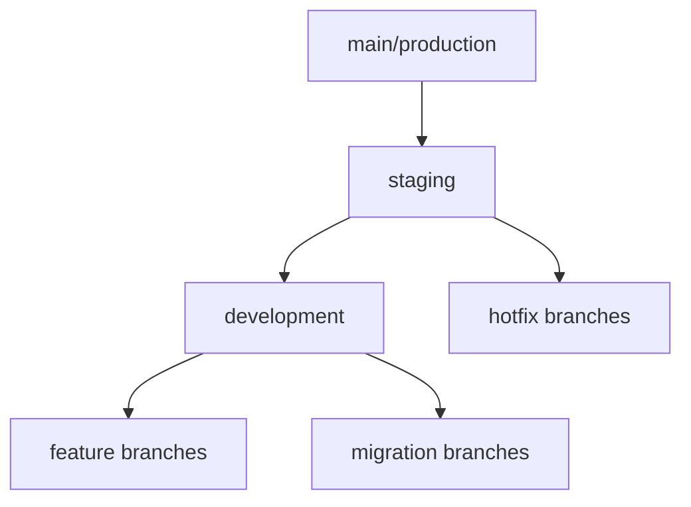

[← Back to Documentation Home](../../README.md)

# Branch Management Best Practices

## Branch Hierarchy



## Core Branches

### 1. Main Branch (`main`)
- **Purpose**: Production-ready code
- **Protected**: Yes, requires PR and approvals
- **Deployments**: Auto-deploys to production
- **Rules**:
  - No direct commits
  - Must pass all tests
  - Requires code review
  - Must be up-to-date with staging

### 2. Staging Branch (`staging`)
- **Purpose**: Pre-production testing
- **Protected**: Yes, requires PR
- **Deployments**: Auto-deploys to staging environment
- **Rules**:
  - No direct commits
  - All features must be tested here
  - Integration testing happens here
  - Performance testing required

### 3. Development Branch (`development`)
- **Purpose**: Integration of features
- **Protected**: Partially
- **Deployments**: Auto-deploys to development environment
- **Rules**:
  - Feature branches merge here first
  - Must maintain working state
  - Continuous integration testing

## Working Branches

### 4. Feature Branches
- **Naming**: `feature/descriptive-name`
- **Created from**: `development`
- **Merges to**: `development`
- **Lifecycle**:
  1. Create from latest development
  2. Develop feature
  3. Test thoroughly
  4. Create PR to development
  5. Address review comments
  6. Merge and delete branch

### 5. Database Migration Branches
- **Naming**: `migration/YYYYMMDD-description`
- **Created from**: `development`
- **Merges to**: `development`
- **Special Rules**:
  - Must include rollback scripts
  - Test migrations in isolation
  - Document all changes
  - Extra review required

### 6. Hotfix Branches
- **Naming**: `hotfix/issue-description`
- **Created from**: `staging`
- **Merges to**: `staging` and `main`
- **Purpose**: Emergency production fixes

## Workflow Examples

### New Feature Development
```bash
# Start new feature
git checkout development
git pull origin development
git checkout -b feature/user-authentication

# Work on feature...

# Keep up to date
git fetch origin
git rebase origin/development

# Create PR when ready
```

### Database Migration
```bash
# Create migration branch
git checkout development
git checkout -b migration/20240315-add-user-profiles

# Create migration files...

# Test thoroughly
# Create PR with extra reviewers
```

### Hotfix Process
```bash
# Create hotfix branch
git checkout staging
git checkout -b hotfix/fix-login-issue

# Fix issue...

# Create PR to staging
# After merge, cherry-pick to main
```

## Best Practices

1. **Branch Hygiene**
   - Delete merged feature branches
   - Keep branches up to date
   - Regular rebasing on development

2. **Commit Messages**
   - Clear, descriptive messages
   - Reference issue numbers
   - Use conventional commits

3. **Pull Requests**
   - Include description of changes
   - Add relevant reviewers
   - Link to related issues
   - Include test results

4. **Protection Rules**
   - Protect main and staging branches
   - Require PR reviews
   - Enforce status checks
   - No force pushes

5. **Regular Maintenance**
   - Clean up old branches
   - Regular merges to staging
   - Scheduled deployments
   - Document major changes

## Common Commands

```bash
# Create feature branch
./scripts/new-feature.sh feature-name

# Promote to staging
./scripts/promote.sh dev staging

# Promote to production
./scripts/promote.sh staging prod

# Update feature branch
git checkout feature/my-feature
git fetch origin
git rebase origin/development
```

## Emergency Procedures

1. **Production Issues**
   - Create hotfix branch
   - Fix and test
   - Deploy to staging first
   - Quick review required
   - Deploy to production
   - Backport to development

2. **Failed Deployment**
   - Automatic rollback
   - Investigate in staging
   - Fix in hotfix branch
   - Re-deploy when ready

Remember: The goal of branch management is to maintain a stable production environment while enabling efficient development and testing processes. 