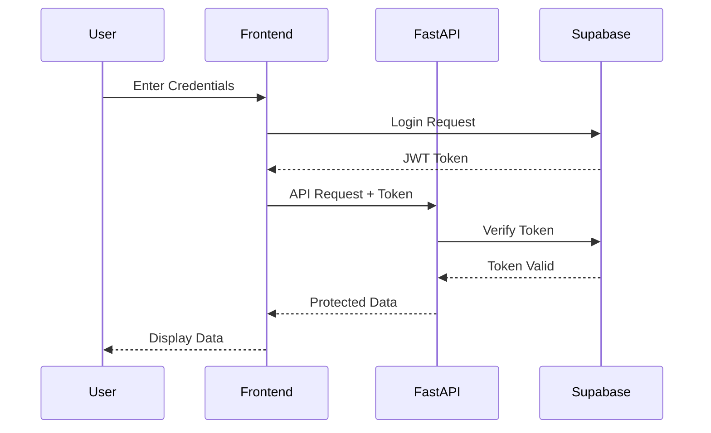

# Authentication Flow

## Overview

The authentication system uses Supabase Auth with JWT tokens and implements role-based access control.

## Authentication Flow Diagram



## Implementation Details

### 1. Token Management

```typescript
// frontend/src/hooks/useAuth.ts
export const useAuth = () => {
  const login = async (email: string, password: string) => {
    const { data, error } = await supabase.auth.signInWithPassword({
      email,
      password,
    });
    if (error) throw error;
    return data;
  };

  const logout = async () => {
    await supabase.auth.signOut();
  };

  return { login, logout };
};
```

### 2. Token Verification

```python
# backend/src/app/core/auth.py
async def verify_token(token: str) -> dict:
    try:
        user = supabase_client.auth.get_user(token)
        return user
    except Exception as e:
        raise HTTPException(
            status_code=401,
            detail="Invalid authentication credentials"
        )
```

### 3. Role-Based Access

```python
# backend/src/app/core/permissions.py
from enum import Enum
from typing import List

class Role(str, Enum):
    ADMIN = "admin"
    USER = "user"
    GUEST = "guest"

def requires_roles(roles: List[Role]):
    def decorator(func):
        async def wrapper(current_user: dict, *args, **kwargs):
            if current_user["role"] not in roles:
                raise HTTPException(
                    status_code=403,
                    detail="Insufficient permissions"
                )
            return await func(current_user, *args, **kwargs)
        return wrapper
    return decorator
```

## Security Considerations

1. **Token Storage**
   - JWTs stored in secure HTTP-only cookies
   - Refresh tokens with limited lifetime
   - Secure token rotation

2. **Request Security**
   - CORS configuration
   - Rate limiting
   - CSRF protection

3. **Error Handling**
   - Secure error messages
   - Audit logging
   - Breach detection 