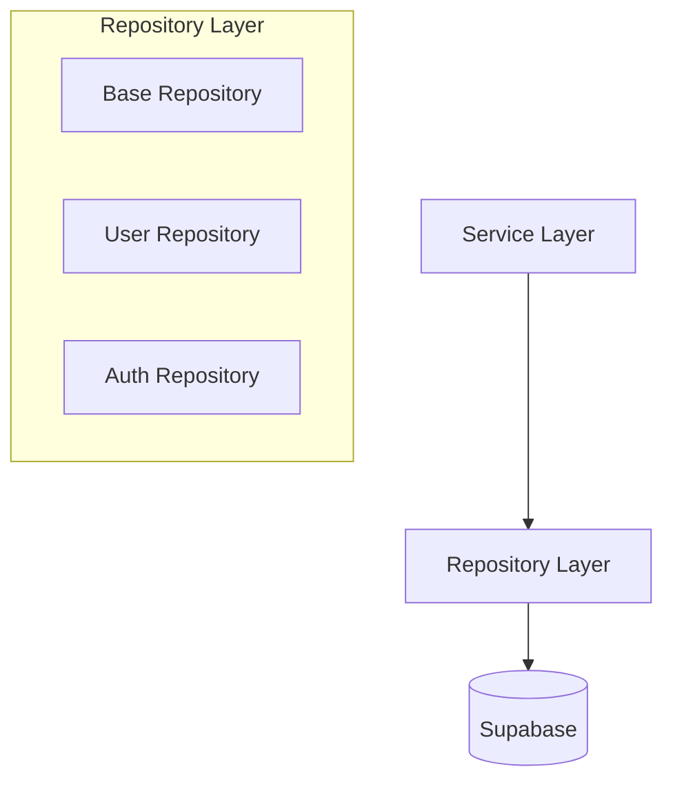

# Data Access Layer

## Overview

The data access layer implements the repository pattern using Supabase, providing a clean interface for database operations.

## Architecture Diagram



## Implementation Details

### 1. Base Repository

```python
# backend/src/app/db/base_repository.py
from typing import Generic, TypeVar, Optional, List
from pydantic import BaseModel

T = TypeVar('T', bound=BaseModel)

class BaseRepository(Generic[T]):
    def __init__(self, table_name: str):
        self.table_name = table_name
        self.client = SupabaseDB.get_client()

    async def find_one(self, filters: dict) -> Optional[T]:
        response = (
            self.client.table(self.table_name)
            .select("*")
            .match(filters)
            .limit(1)
            .execute()
        )
        return response.data[0] if response.data else None

    async def find_many(
        self,
        filters: dict,
        skip: int = 0,
        limit: int = 100
    ) -> List[T]:
        response = (
            self.client.table(self.table_name)
            .select("*")
            .match(filters)
            .range(skip, skip + limit)
            .execute()
        )
        return response.data
```

### 2. Query Building

```python
# backend/src/app/db/query_builder.py
from typing import Any, Dict, List

class QueryBuilder:
    def __init__(self, table_name: str):
        self.table_name = table_name
        self.query = None

    def select(self, columns: List[str]) -> 'QueryBuilder':
        self.query = (
            self.client.table(self.table_name)
            .select(",".join(columns))
        )
        return self

    def filter(self, conditions: Dict[str, Any]) -> 'QueryBuilder':
        self.query = self.query.match(conditions)
        return self

    def order_by(self, column: str, ascending: bool = True) -> 'QueryBuilder':
        self.query = (
            self.query.order(column, ascending=ascending)
        )
        return self

    def execute(self):
        return self.query.execute()
```

## Usage Examples

### 1. Basic CRUD Operations

```python
# Example repository usage
async def create_user(user_data: dict):
    return await user_repository.create(user_data)

async def get_user_by_email(email: str):
    return await user_repository.find_one({"email": email})

async def list_active_users(skip: int = 0, limit: int = 10):
    return await user_repository.find_many(
        {"is_active": True},
        skip=skip,
        limit=limit
    )
```

### 2. Complex Queries

```python
# Example of complex query building
async def search_users(
    search_term: str,
    filters: dict,
    sort_by: str,
    ascending: bool
):
    query = (
        QueryBuilder("users")
        .select(["id", "email", "full_name", "created_at"])
        .filter(filters)
        .order_by(sort_by, ascending)
    )
    
    if search_term:
        query.text_search(["email", "full_name"], search_term)
    
    return await query.execute()
```

## Performance Considerations

1. **Query Optimization**
   - Efficient indexing
   - Query caching
   - Batch operations

2. **Connection Management**
   - Connection pooling
   - Transaction handling
   - Error recovery

3. **Data Consistency**
   - Optimistic locking
   - Versioning
   - Conflict resolution 