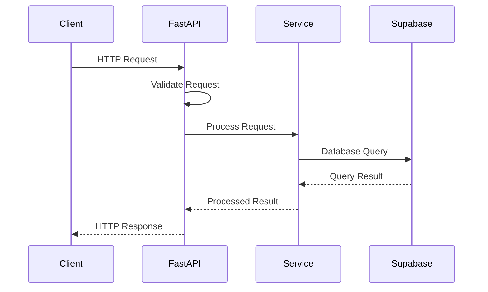
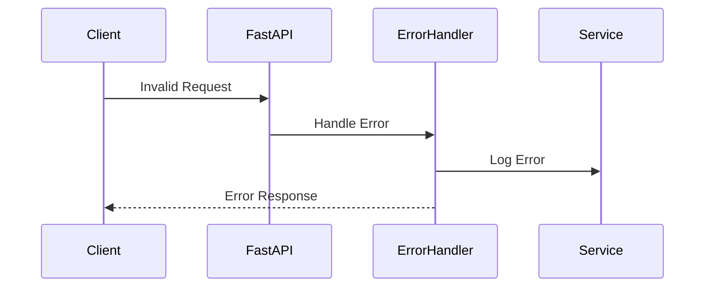

# Data Flow Architecture

## Request Flow

## Error Handling Flow

## Data Validation Flow

1. **Request Validation**
   - HTTP request validation
   - Schema validation
   - Type checking

2. **Business Validation**
   - Business rule checking
   - State validation
   - Permission checking

3. **Response Validation**
   - Output schema validation
   - Response formatting
   - Error wrapping 