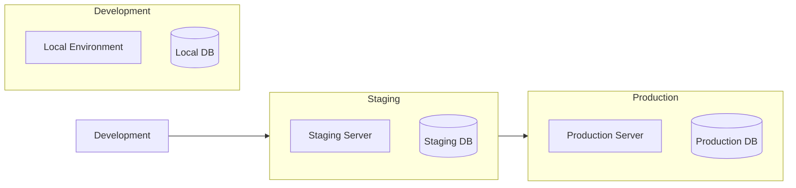

# Deployment Architecture

## Environment Setup

## Infrastructure Components

### 1. Application Servers
- FastAPI application servers
- Load balancer
- Rate limiting
- SSL termination

### 2. Database
- Supabase managed PostgreSQL
- Read replicas
- Automated backups
- Point-in-time recovery

### 3. Caching Layer
- Redis cache
- Cache invalidation
- Session storage
- Rate limit tracking

## Scaling Strategy

1. **Horizontal Scaling**
   - Multiple application instances
   - Load balancer distribution
   - Session stickiness

2. **Database Scaling**
   - Read replicas
   - Connection pooling
   - Query optimization

3. **Caching Strategy**
   - Response caching
   - Data caching
   - Cache invalidation 