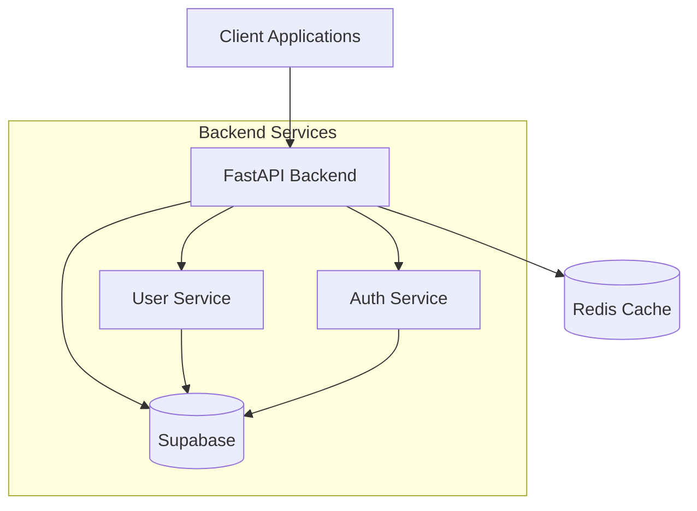

# Architecture Overview

## System Architecture

## Key Components

### 1. Frontend (React + Vite)
- Single Page Application (SPA)
- TypeScript for type safety
- Component-based architecture
- State management with Zustand
- API integration with React Query

### 2. Backend (FastAPI)
- Domain-driven design
- Async request handling
- Middleware for authentication and rate limiting
- Comprehensive error handling
- API documentation with OpenAPI

### 3. Database (Supabase)
- PostgreSQL database
- Row Level Security (RLS)
- Real-time subscriptions
- Built-in authentication
- Automated backups

## Security Architecture

- JWT-based authentication
- Role-based access control (RBAC)
- Rate limiting per endpoint
- Input validation at all layers
- Secure password hashing
- HTTPS enforcement 