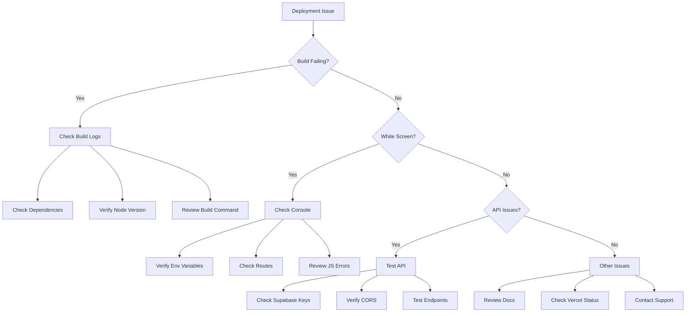

# Vercel Deployment Guide for Beginners

## Prerequisites
Before starting, make sure you have:
- A GitHub account (sign up at github.com if needed)
- Your project pushed to GitHub
- Node.js installed (download from nodejs.org)

## 1. Initial Vercel Setup

### 1.1 Connect Vercel to GitHub
1. Open your web browser and go to [vercel.com](https://vercel.com)

2. Create a Vercel Account:
   - Look for the "Sign Up" button in the top-right corner
   - Click "Continue with GitHub" (black button with GitHub logo)
   - If not already logged into GitHub, enter your GitHub credentials
   - You'll see a permission request from GitHub - click "Authorize Vercel"

3. Create Your First Project:
   - After logging in, you'll see the Vercel dashboard
   - Look for the large "Import Project" or "New Project" button
   - Click it to start the project creation process

4. Import Your Repository:
   - You'll see a list of your GitHub repositories
   - If you don't see "dhg-composer", click "Configure GitHub App Integration"
   - In the GitHub permissions page, either:
     - Select "All repositories" or
     - Choose "Only select repositories" and find "dhg-composer"
   - Click "Install" or "Save" to confirm

5. Configure Project Settings:
   - After clicking "Import" on your repository, you'll see the "Configure Project" page
   - This is a form-like page with several important sections from top to bottom:

   a) Project Name (Top of page):
      - A text field with an auto-suggested name
      - Usually your repo name in lowercase
      - You can change this if you want
   
   b) Framework Preset (Below project name):
      - A dropdown menu labeled "Framework Preset"
      - Click it and type "vite" to filter
      - Or scroll until you find "Vite"
      - The icon looks like a yellow V
   
   c) Root Directory (Middle of page):
      - Look for "Root Directory" with a folder icon
      - By default shows "."
      - Click the "Edit" button (pencil icon)
      - A folder browser popup appears
      - Click through: apps → dhg-baseline → frontend
      - Click "Save" in the popup
   
   d) Build Settings (Lower section):
      - Look for "Build and Output Settings"
      - If collapsed, click to expand
      - You'll see three input fields:
        1. Build Command: Clear default and enter `npm run vercel-build`
        2. Output Directory: Clear default and enter `dist`
        3. Install Command: Clear default and enter `npm install --no-workspaces`

6. Environment Variables:
   - Before deploying, scroll down to "Environment Variables"
   - Click "Add New" for each variable:
   
   First variable:
   ```
   NAME: VITE_SUPABASE_URL
   VALUE: [Your Supabase URL]
   ENVIRONMENTS: Select all (Production, Preview, Development)
   ```
   
   Second variable:
   ```
   NAME: VITE_SUPABASE_ANON_KEY
   VALUE: [Your Supabase Anon Key]
   ENVIRONMENTS: Select all (Production, Preview, Development)
   ```
   
   Third variable:
   ```
   NAME: VITE_API_URL
   VALUE: [Your API URL - e.g., https://api.yoursite.com]
   ENVIRONMENTS: Select all (Production, Preview, Development)
   ```

7. Deploy Settings:
   - Review all settings one final time
   - Look for any warning icons or messages
   - Click the large "Deploy" button at the bottom
   - You'll be taken to the deployment page where you can watch the build progress

8. Verify Initial Deployment:
   - Wait for the first deployment to complete
   - Look for a green checkmark ✅
   - Click the "Visit" button to see your deployed site
   - Check that the URL works and site loads
   - Open browser dev tools (F12) to check for errors

9. Additional Project Settings:
   - After first deploy, click "Settings" in top nav
   - Review and configure:
     - Domains (add custom domains if needed)
     - Environment Variables (verify all are set)
     - Git (configure branch deployments - covered in next section)

## 2. Git Branch Configuration

### 2.1 Set Up Branch Deployments
1. In your project settings:
2. Click "Git" in the left sidebar
3. Scroll to "Branch Deployments"
4. Configure each branch:
   - Production Branch:
     - Click "Edit"
     - Type "main"
     - Select "Only build Production Branch"
   - Development Branch:
     - Click "Add"
     - Type "development"
   - Preview Branches:
     - Click "Add"
     - Type "feature/*"
     - This will match all feature branches

### 2.2 Create Vercel Ignore File
1. In your local project:
2. Create a new file named `.vercelignore` in the root:
   ```bash
   touch .vercelignore
   ```
3. Open `.vercelignore` and add:
   ```
   # Ignore everything
   *
   
   # Include frontend files
   !apps/dhg-baseline/frontend/
   !apps/dhg-baseline/frontend/src/
   !apps/dhg-baseline/frontend/public/
   !apps/dhg-baseline/frontend/index.html
   !apps/dhg-baseline/frontend/package.json
   !apps/dhg-baseline/frontend/tsconfig.json
   !apps/dhg-baseline/frontend/vite.config.ts
   !apps/dhg-baseline/frontend/tailwind.config.js
   !apps/dhg-baseline/frontend/postcss.config.js
   
   # Include root config files
   !package.json
   !turbo.json
   !.npmrc
   !.nvmrc
   ```

## 3. Project Configuration

### 3.1 Update Package Files
1. Open root `package.json`, add these scripts:
   ```json
   {
     "scripts": {
       "vercel-build": "turbo run build --filter=dhg-baseline-frontend^...",
       "vercel-install": "npm install --no-workspaces"
     }
   }
   ```

2. Open `apps/dhg-baseline/frontend/package.json`, add:
   ```json
   {
     "scripts": {
       "vercel-build": "vite build"
     }
   }
   ```

### 3.2 Create Vercel Config
1. In your project root, create `vercel.json`:
   ```bash
   touch vercel.json
   ```
2. Add this configuration:
   ```json
   {
     "version": 2,
     "buildCommand": "cd apps/dhg-baseline/frontend && npm install --legacy-peer-deps && npm run build",
     "outputDirectory": "apps/dhg-baseline/frontend/dist",
     "framework": "vite",
     "installCommand": "true",
     "ignoreCommand": "exit 0",
     "git": {
       "deploymentEnabled": {
         "main": false,
         "development": true,
         "feature/*": true
       }
     }
   }
   ```

## 4. Deployment Process

### 4.1 Initial Deployment
1. Commit all configuration files:
   ```bash
   git add .vercelignore vercel.json package.json
   git commit -m "chore: add vercel configuration"
   ```

2. Push your feature branch:
   ```bash
   git push -u origin feature/pure-monorepo
   ```

3. Watch deployment:
   - Go to Vercel Dashboard
   - Click on your project
   - You should see a new deployment starting
   - Click on it to view build logs

### 4.2 Verify Your Deployment
1. After successful build:
   - Click "Visit" button in Vercel
   - Your app should load
   - Check browser console for errors
   - Try logging in (if auth is set up)

2. If something's wrong:
   - Check "Build Logs" in Vercel
   - Verify environment variables
   - Check browser console
   - Try a test deployment locally:
     ```bash
     npm run build
     npm run preview
     ```

### 4.3 Common Issues & Solutions
- **Build Fails**:
  1. Check node version in `.nvmrc`
  2. Verify all dependencies are in package.json
  3. Look for syntax errors in build logs

- **White Screen**:
  1. Check browser console
  2. Verify environment variables
  3. Check routing configuration

- **API Errors**:
  1. Verify Supabase URL and key
  2. Check CORS settings
  3. Test API endpoints separately

## Troubleshooting Guide



### Common Error Patterns

1. **Build Failures**
   ```bash
   Error: Cannot find module '@dhg/auth-service'
   ```
   ✅ Solution: Check workspace dependencies and build order

2. **Runtime Errors**
   ```javascript
   Error: VITE_SUPABASE_URL is undefined
   ```
   ✅ Solution: Verify environment variables in Vercel dashboard

3. **API Connection Issues**
   ```javascript
   Error: Failed to fetch from Supabase
   ```
   ✅ Solution: Check CORS settings and API keys

## 5. Ongoing Maintenance

### 5.1 Set Up Monitoring
1. In Vercel Dashboard:
   - Click "Analytics" tab
   - Click "Enable Analytics"
   - Choose metrics to track

2. Set up alerts:
   - Go to Settings → Notifications
   - Add team members
   - Configure deployment alerts

### 5.2 Regular Checks
Weekly tasks:
1. Review deployments:
   - Check success rates
   - Monitor build times
   - Review error logs

2. Clean up:
   - Remove old preview deployments
   - Update dependencies if needed
   - Review environment variables

Need help? Check:
- [Vercel Documentation](https://vercel.com/docs)
- [Vite Documentation](https://vitejs.dev/guide/)
- [Troubleshooting Guide](https://vercel.com/guides/troubleshooting-vercel-cli)
